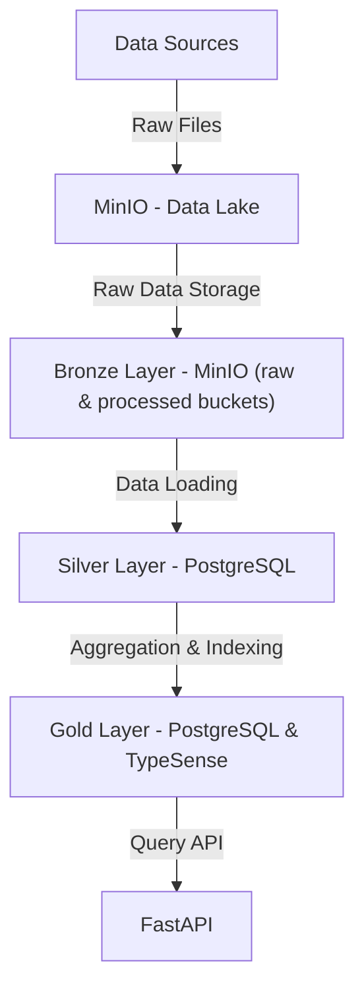
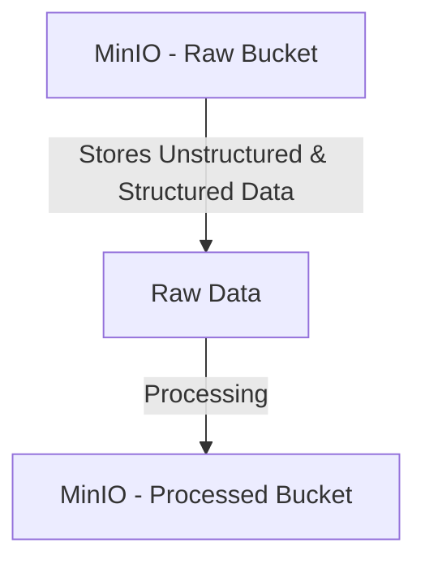
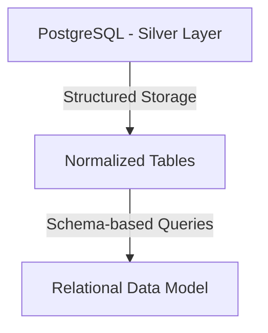
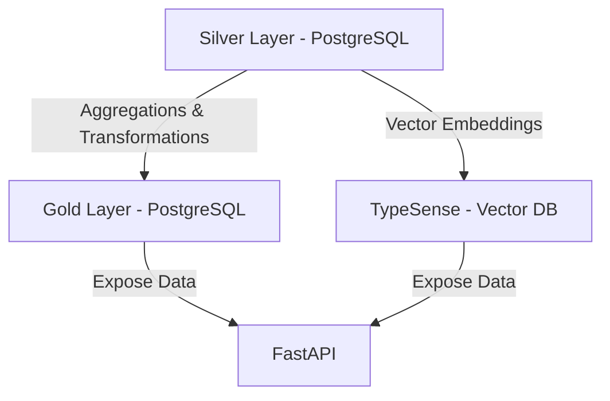

# DEChallenge

## Setting up the project
### Just to run it
Only docker is needed and you need just two commands:
`docker-compose up -d`

and once all containers are running, run

`docker exec fastapi_app alembic upgrade head`

to get the needed schema into de DB. That's all

### To develop
Create a virtual environment running
 
 `python -m venv .venv`
 
  (it's very important you don't name the virtual environment .env) and immediately activate it running
 
 `.venv/Scripts/Activate.ps1`

once done, install poetry running

`pip install poetry`

and

`poetry install`

This should let you have all python dependencies installed.

### 
You'll need to modify the .env file, change all containers names (postgres_dev, minio and typesense) for localhost, and do the same in alembic.ini file too.

Ensure you have docker and docker-compose installed.

Run

`docker-compose up -d`

Once all containers are running, you need to run 

`alembic upgrade head`

and everything should be ready to go.

## Running the project

Again, make sure all containers are running with

`docker-compose up -d`

You can now access swagger in localhost:8000/docs

If you are planning to run the app outside docker, then:

`fastapi dev .\main.py`

will also let you run everything

### Api order

So far the ETL process isn't fully automated, so API calls need to be done in order. In sample files you can find a few files to test the system. The API credentials are ADMIN ADMIN, and they are defined in the .env file.

First, upload them to **/ingestion/uploadFiles**, then in order run 
- **/digestion/processFiles**
- **/digestion/processLyrics**
- **/digestion/populateTypesense**
- **/digestion/updateGoldLayer**

The query API now should be ready to use.

# Mermaid diagram

## Overall Data Lake Organization

---

## Bronze Layer (Raw Data)

---

## Silver Layer (Refined Data - Star Schema)

---

## Gold Layer (Aggregated Data)

