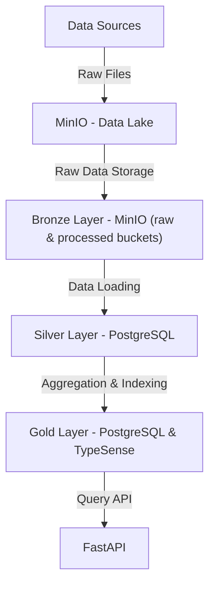
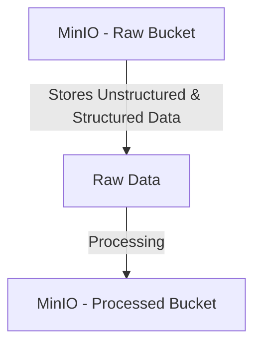
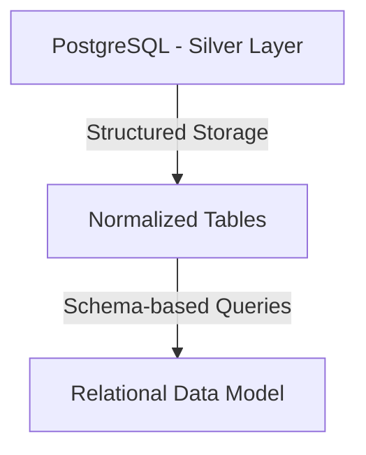
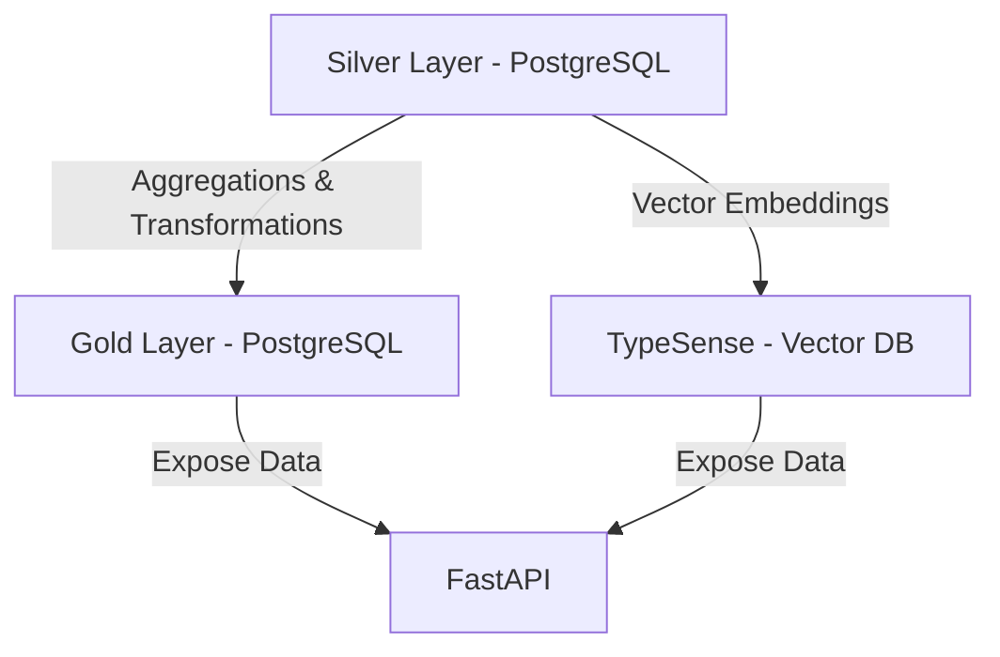

# DEChallenge
## About the project
### What's this?
It's an API to ingest, process and query music data. It's thought in a way that everything should run locally without issues. To achieve this, everything has been containairized.

#### How was it made?
Architecture and technical details are better explained in later sections. Next goes a bit on my thought process for the project.

The dataset used is mostly [Million songs data](https://millionsongdataset.com/). A music dataset was chosen because I figured that a star/snowflake schema could be done easily with songs and their info, artists and their info, albums and their info, genre, release date and more, while having lyrics as a long text to really put to use the vector DB. Sadly this dataset disappointed me having tons of records but not a lot of info in each one. I kept it with the hopes of being able to enrich data later and finishing the schema, but only managed to do so with lyrics. Also found a musicbrainz API to get the genre, but time was against me. I checked some other datasets, such as one with amazon's products review, but there wasn't enough data for a star schema, and I thought about making my own  synthetic data to get a nice and simple schema, but getting text for the vector DB wouldn't be easy.

Most of the decisions I took along the project were time related. Most of all I aimed for a running project with the medallion architecture, which meant data quality ended up taking a hit. While I'm overall satisfied with the result, I can see multiple things that I'd like to improve:
- Later it's better explained, but it's just not a good design to have to trigger manually the ETL for each layer. It simply was a fast and reliable one. Personally I would've liked to either trigger minio's events or even have teh async request-reply pattern.
- Again, the schema for the data isn't the best. It was thought in a way that could be expanded as I found more info, and I figure that shouldn't be hard.
- I found pydantic models to be a nice to have. They make for better API documentation and help enforce typing, but they are not needed to get the project running.
- The same can be said about testing and logging. I even thought of having a separate bucket for logs in minio.
- Querying API is really poor. This is a direct consequence of the schemas not being complex enough.
- Lack of pandas is probably my biggest regret. Pyspark was immediately discarded as I firmly believe that setting up a container with both docker and python would be a huge headache, but I did think that a pandas transformation would be feasible. Anyways, here's a panda, hope that makes up for it:
```
⠀⠀⠀⠀⠀⢀⡀⠀⠀⠀⠀⠀⠀⠀⠀⠀
⠀⠀⠀⠀⢰⣿⡿⠗⠀⠠⠄⡀⠀⠀⠀⠀
⠀⠀⠀⠀⡜⠁⠀⠀⠀⠀⠀⠈⠑⢶⣶⡄
⢀⣶⣦⣸⠀⢼⣟⡇⠀⠀⢀⣀⠀⠘⡿⠃
⠀⢿⣿⣿⣄⠒⠀⠠⢶⡂⢫⣿⢇⢀⠃⠀
⠀⠈⠻⣿⣿⣿⣶⣤⣀⣀⣀⣂⡠⠊⠀⠀
⠀⠀⠀⠃⠀⠀⠉⠙⠛⠿⣿⣿⣧⠀⠀⠀
⠀⠀⠘⡀⠀⠀⠀⠀⠀⠀⠘⣿⣿⡇⠀⠀
⠀⠀⠀⣷⣄⡀⠀⠀⠀⢀⣴⡟⠿⠃⠀⠀
⠀⠀⠀⢻⣿⣿⠉⠉⢹⣿⣿⠁⠀⠀⠀⠀
⠀⠀⠀⠀⠉⠁⠀⠀⠀⠉⠁⠀⠀⠀⠀⠀
```

## Setting up the project
### I just want to run it

Only docker is needed and you need just two commands:
`docker-compose up -d`

and once all containers are running, run

`docker exec fastapi_app alembic upgrade head`

to get the needed schema into de DB. That's all. In sample_files folder you should find enough data to test the system.

Note: I developed everything in Windows. I know for a fact that some extra modifications are needed to run the images in Linux, most likely related to execution permissions. I know Docker's whole thing is running in every computer, but I just placed a pandas because I couldn't run pandas. I wasn't debugging dockerfiles for every OS. Thanks for understanding :-).

### To develop
Create a virtual environment running
 
 `python -m venv .venv`
 
  (it's very important you don't name the virtual environment .env) and immediately activate it running
 
 `.venv/Scripts/Activate.ps1`

once done, install poetry running

`pip install poetry`

and

`poetry install`

This should let you have all python dependencies installed. I like running the project setting up all containers except the fastapi one, and run in another console

`fastapi dev .\main.py`

You'll need to modify the .env file, change all containers names (postgres_dev, minio and typesense) for localhost, and do the same in alembic.ini file too.

### Using the API

If you are running with my configuration, then swagger should be up and running in **localhost:8000/docs**

### Api order

So far the ETL process isn't fully automated, so API calls need to be done in order. In sample files you can find a few files to test the system. The API credentials are ADMIN ADMIN, and they are defined in the .env file.

First, upload them to **/ingestion/uploadFiles**, then in order run 
- **/digestion/processFiles**
- **/digestion/processLyrics**
- **/digestion/populateTypesense**
- **/digestion/updateGoldLayer**

The query API now should be ready to use.

# Mermaid diagram

## Overall Data Lake Organization



---

## Bronze Layer (Raw Data)



---

## Silver Layer (Refined Data - Star Schema)



---

## Gold Layer (Aggregated Data)

